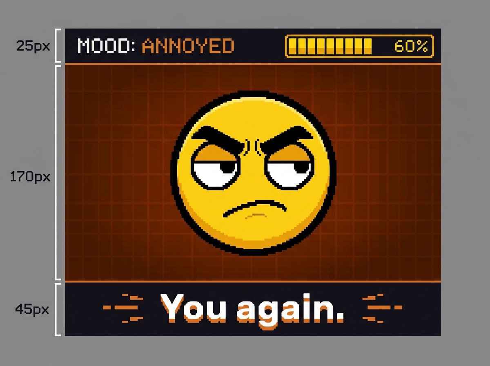
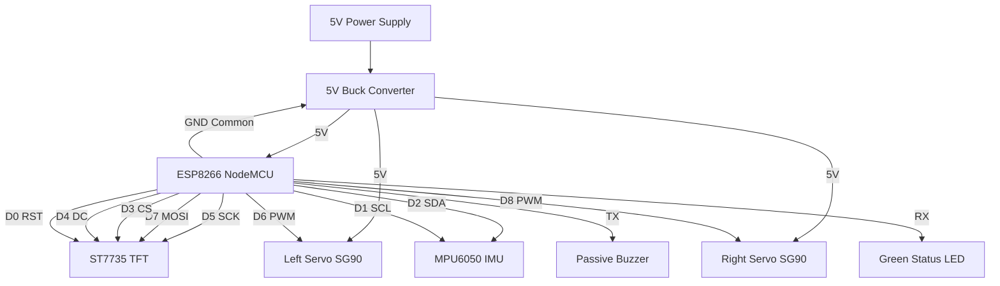
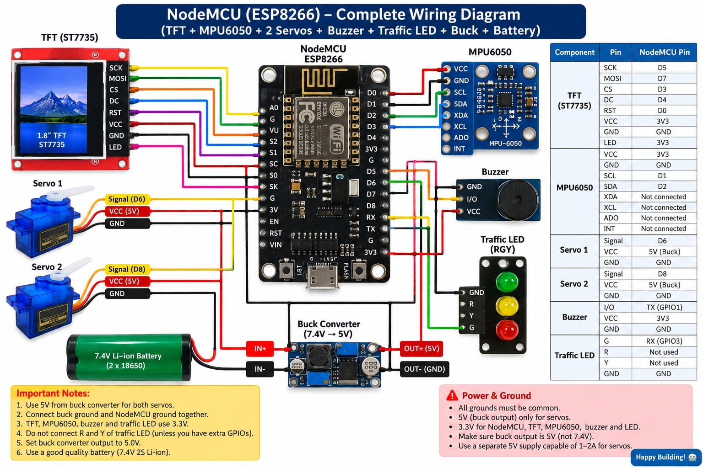
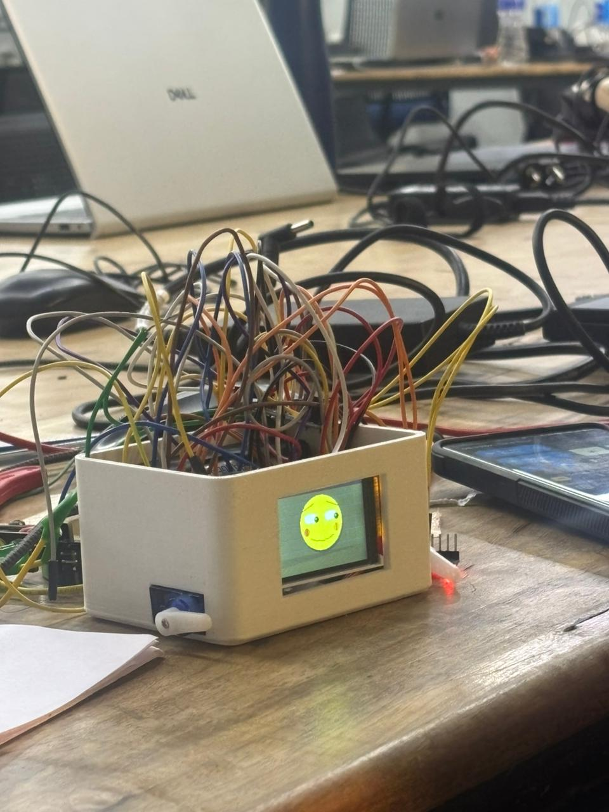

# HateBot 🤖😤

> *The utterly useless judgmental robot that exists purely to make you regret touching it.*

---

## Basic Details
### Team Name: Hateu_robo

### Project Description
HateBot sits on your desk, detects when you've disturbed it, and responds with maximum contempt — a disgusted face on screen, a dismissive arm flick, an annoyed buzz, and a mood LED that escalates from "tolerating you" to "furious." The joke is the point: massive engineering effort, zero useful output.

### The Problem (that doesn't exist)
Nobody asked for a robot that hates them. Desktop robots are usually friendly and helpful. This is wrong.

### The Solution (that nobody asked for)
A robot with a full emotional state machine calibrated entirely around contempt. The more you bother it, the angrier it gets, until it eventually gives up on you entirely and sulks in silence.

---

## Mood State Machine

```
        [idle sigh]
            |
        (IMU: small tilt) ──> ANNOYED ──(more disturbance)──> FURIOUS
            |                     |                               |
      (no input, 12s)       (no input, 10s)               (no input, 30s)
            |                     |                               |
            v                     v                               v
          CALM  <──────────────────────────────────────────── SULKING
                                                          (after 3 FURIOUS hits)
```

| Mood | LED | Face | Arms | Sound |
|---|---|---|---|---|
| **CALM** | 🟢 slow pulse | Bored slits, flat mouth | Occasional slow twitch | Rare low "hmph" |
| **ANNOYED** | 🟡 solid | Side-eye, angled brows | Quick synchronized flick | Two-tone descending "eh-eh" |
| **FURIOUS** | 🔴 blinking | Hard squint, V-brows, bared teeth | Rapid alternating flap x4 | Rising buzz sequence |
| **SULKING** | 🔴 slow blink | X eyes, resigned mouth | Raise & hold ("stop" pose) | One long low tone, then silence |

---

## Bill of Materials

| Component | Notes |
|---|---|
| NodeMCU ESP8266 | Microcontroller |
| TFT Display (ST7735, 1.8" SPI) | Face + insult text |
| IMU (MPU6050 I2C) | Detects tilt, shake, pickup, tap |
| Passive Buzzer | Emotional tones via PWM |
| 2× Micro Servo (SG90) | Arms — dismissive gestures |
| Single Green LED + Resistor | Mood indicator blinker |
| 5V Buck Converter | Servos + display need external power |
| Breadboard / perfboard, wires | Build |
| 3D Printed Enclosure | `hateu_pod.scad` — see `/hateu_pod.scad` |

> ⚠️ **Power Note:** Servos need their own 5V rail. Share only common ground with the ESP8266. Running servos off the ESP8266 3.3V will brown-out the microcontroller.

---

## Pin Mapping (ESP8266)

| Component | Signal | NodeMCU Pin | GPIO |
|---|---|---|---|
| **TFT ST7735** | SCK | D5 | 14 |
| | MOSI | D7 | 13 |
| | CS | D3 | 0 |
| | DC / A0 | D4 | 2 |
| | RESET | D0 | 16 |
| **MPU6050** | SDA | D2 | 4 |
| | SCL | D1 | 5 |
| **Servos** | Left Arm | D6 | 12 |
| | Right Arm | D8 | 15 |
| **Output** | Buzzer | TX | 1 |
| | Green LED | RX | 3 |

---

## IMU Interaction Detection

Reads at ~30 Hz, classifies events:

| Event | Detection | Mood Weight |
|---|---|---|
| **Tap / Knock** | High-pass acceleration spike | +1 |
| **Tilt** | Static angle > 15° from resting baseline | +1 |
| **Shake** | Rolling 8-sample variance spike | +2 |
| **Pickup** | Z-accel departs >0.3g for >500ms | +3 |

Picking it up is the fastest way to make it furious.

---

## Technical Details

### Software
- **Language:** C++ (Arduino framework for ESP8266)
- **Libraries:**
  - `Adafruit_ST7735` — TFT display
  - `Adafruit_GFX` — graphics primitives
  - `Servo` — standard ESP8266 servo library
  - `MPU6050` by Electronic Cats — IMU
  - `Wire`, `SPI` — built-in

---

## Installation

```bash
# 1. Install Arduino IDE 2.x
# 2. Add ESP8266 board package via Boards Manager
# 3. Install libraries via Library Manager:
#    - Adafruit ST7735 and ST7789 Library
#    - Adafruit GFX Library
#    - MPU6050 by Electronic Cats
# 4. Open firmware/hatebot/hatebot.ino
# 5. Select board: "NodeMCU 1.0 (ESP-12E Module)"
# 6. Upload
```

---

## Project Documentation

### Displays & UI

*Procedural face engine and typewriter text bar*

### Schematic & Circuit (Mermaid)




*Hardware wiring overview*

### Build Photos

*The final assembled HateBot*

---

## Roadmap of Uselessness (optional extensions)

- [ ] Light sensor — complains about room lighting
- [ ] Microphone — react to being yelled at
- [ ] "Forgiveness" gesture — hold level for 10s → rare, begrudging compliment

---

## Team Contributions
- **Anandhan**: Software and hardware integration
- **bhagath**: Hardware and 3D printing

---
Made with ❤️ at TinkerHub Useless Projects


